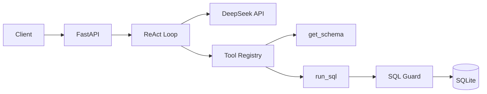
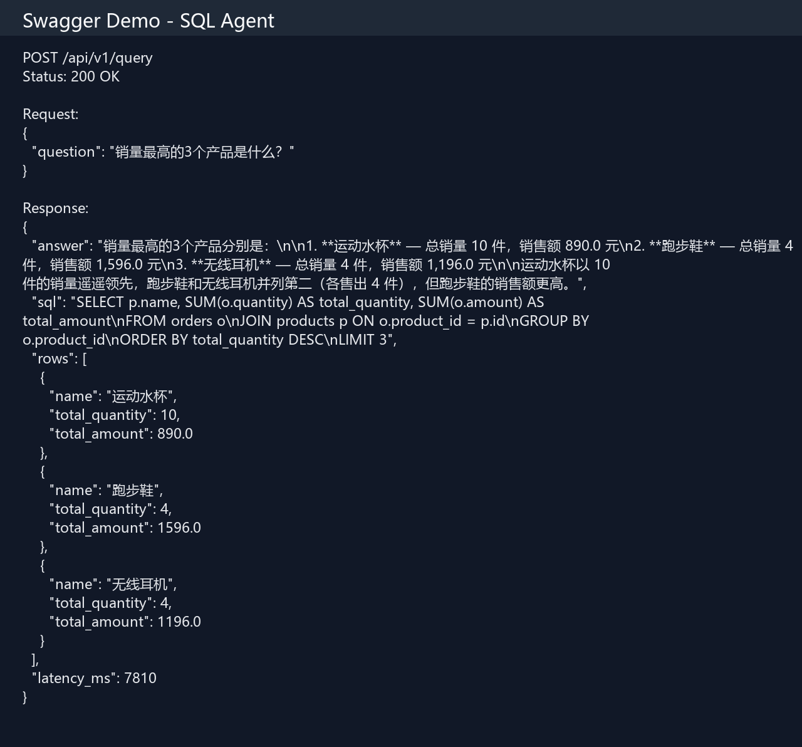
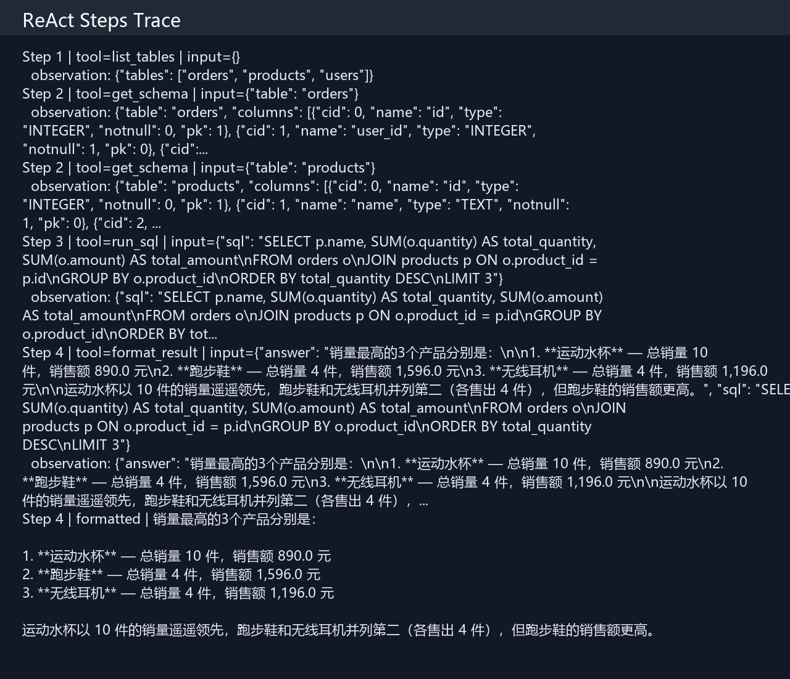

<div align="center">

# SQL Agent

**基于 FastAPI + DeepSeek + ReAct 的自然语言问数后端服务**

[](https://www.python.org/)
[](https://fastapi.tiangolo.com/)
[](https://platform.deepseek.com/)
[](LICENSE)

用户用中文提问 → Agent 自动查表结构 → 生成 SQL → 执行查询 → 返回中文解读

[快速开始](#快速开始) · [API 示例](#api-示例) · [响应示例](#响应示例) · [项目结构](#项目结构)

</div>

---

## 项目简介

面向后端实习作品设计的 **Text-to-SQL Agent** 服务。核心链路：

```
用户提问 → ReAct Agent → 工具调用(get_schema / run_sql) → SQL 安全校验 → SQLite → 中文回答
```

### 核心亮点

| 能力 | 说明 |
|------|------|
| **ReAct Agent** | 推理 → 调工具 → 观察 → 再推理，最多 5 轮 |
| **DeepSeek API** | OpenAI 兼容接口，中文理解与 SQL 生成表现稳定 |
| **SQL 安全** | 仅允许 SELECT，拦截 DELETE/DROP/多语句/注释注入 |
| **自动纠错** | SQL 执行失败时将 DB 错误反馈给 LLM 并重试 |
| **可观测** | 响应包含完整 `steps` trace，记录每步 tool call |
| **流式输出** | SSE 接口实时推送推理步骤 |

### 技术栈

Python · FastAPI · Pydantic v2 · DeepSeek API · aiosqlite · pytest · Docker

---

## 架构



---

## 快速开始

### 环境要求

- Python 3.10+
- [DeepSeek API Key](https://platform.deepseek.com)

### 1. 克隆并进入项目

```bash
git clone https://github.com/zdw-sudo/sql-agent.git
cd sql-agent
```

### 2. 安装依赖

**Windows（PowerShell / VS Code 终端）：**

```powershell
py -3 -m venv .venv
.\.venv\Scripts\Activate.ps1
pip install -r requirements.txt
```

**macOS / Linux：**

```bash
python3 -m venv .venv
source .venv/bin/activate
pip install -r requirements.txt
```

### 3. 配置 DeepSeek

```powershell
copy .env.example .env   # Windows
# cp .env.example .env   # macOS / Linux
```

编辑 `.env`：

```env
DEEPSEEK_API_KEY=sk-xxxxxxxx
DEEPSEEK_BASE_URL=https://api.deepseek.com
DEEPSEEK_MODEL=deepseek-chat
```

### 4. 初始化样例数据库

```powershell
$env:PYTHONPATH="."          # Windows PowerShell
# export PYTHONPATH=.          # macOS / Linux

py scripts/init_db.py
```

### 5. 启动服务

```powershell
py -m uvicorn app.main:app --reload --port 8000
```

- Web 界面：**http://localhost:8000**
- Swagger 文档：**http://localhost:8000/docs**

> **VS Code 提示：** 用「文件 → 打开文件夹」打开 `sql-agent` 目录（不是父级 `project` 目录），终端会自动定位到正确路径。

---

## API 示例

### 同步问答

**请求：**

```json
POST /api/v1/query
{
  "question": "销量最高的3个产品是什么？"
}
```

> 注意：JSON 最后一个字段后**不要加逗号**；`max_steps` 默认 5，不要设为 1。

**PowerShell curl：**

```powershell
curl -X POST http://localhost:8000/api/v1/query `
  -H "Content-Type: application/json" `
  -d "{\"question\": \"销量最高的3个产品是什么？\"}"
```

### 流式问答（SSE）

```powershell
curl -N -X POST http://localhost:8000/api/v1/query/stream `
  -H "Content-Type: application/json" `
  -d "{\"question\": \"2024年1月哪个城市订单金额最高？\"}"
```

### 健康检查

```powershell
curl http://localhost:8000/health
```

---

## 响应示例

成功响应（`200`）：

```json
{
  "trace_id": "a1b2c3d4-...",
  "question": "销量最高的3个产品是什么？",
  "answer": "销量最高的3个产品是：无线耳机（4件）、运动水杯（5件）、机械键盘（3件）。",
  "sql": "SELECT p.name, SUM(o.quantity) AS total_qty FROM orders o JOIN products p ON o.product_id = p.id GROUP BY p.id, p.name ORDER BY total_qty DESC LIMIT 3",
  "rows": [
    {"name": "无线耳机", "total_qty": 4},
    {"name": "运动水杯", "total_qty": 5},
    {"name": "机械键盘", "total_qty": 3}
  ],
  "steps": [
    {"step": 1, "type": "tool_call", "tool": "get_schema", "input": {"table": "orders"}, "observation": "..."},
    {"step": 1, "type": "tool_call", "tool": "run_sql", "input": {"sql": "SELECT ..."}, "observation": "..."},
    {"step": 2, "type": "tool_call", "tool": "format_result", "input": {"answer": "...", "sql": "..."}, "observation": "..."}
  ],
  "latency_ms": 3200
}
```

---

## Demo 截图

将 Swagger 测试截图放到 `docs/screenshots/` 目录，README 会自动展示。

**快捷生成（服务需已启动）：**

```powershell
$env:PYTHONPATH="."
py scripts/generate_screenshots.py
git add docs/screenshots/*.png
git commit -m "docs: add demo screenshots"
git push
```

| Swagger 问答界面 | ReAct 步骤 trace |
|:---:|:---:|
|  |  |

> 截图方法：在 http://localhost:8000/docs 执行一次成功请求，截取 Request + Response 区域，保存为上述文件名。

---

## 样例数据库

内置 SQLite 电商分析库，3 张表：

| 表 | 字段 | 说明 |
|----|------|------|
| `users` | id, name, city, created_at | 用户 |
| `products` | id, name, category, price | 商品 |
| `orders` | id, user_id, product_id, quantity, amount, order_date | 订单 |

### 推荐测试问题

| 问题 | 考察 SQL 能力 |
|------|--------------|
| 每个城市有多少用户？ | GROUP BY |
| 销量最高的 3 个产品是什么？ | JOIN + ORDER BY + LIMIT |
| 2024年1月的总销售额是多少？ | 日期过滤 + SUM |
| 哪个品类的平均单价最高？ | GROUP BY + AVG |

---

## 项目结构

```
sql-agent/
├── app/
│   ├── main.py                 # FastAPI 入口
│   ├── config.py               # DeepSeek / DB 配置
│   ├── agent/                  # ReAct 循环 + LLM 客户端
│   ├── tools/                  # list_tables / get_schema / run_sql
│   ├── db/                     # SQLite 连接 + seed.sql
│   ├── core/                   # SQL 安全校验
│   └── api/v1/endpoints/       # REST API
├── scripts/init_db.py          # 初始化样例数据
├── tests/                      # pytest 单测（10 条）
├── docs/screenshots/           # Demo 截图
├── requirements.txt
└── data/sample.db              # 运行时生成（gitignore）
```

---

## 测试

在项目根目录 `sql-agent/` 下执行：

```powershell
$env:PYTHONPATH="."
py -m pytest -v
```

预期输出：`10 passed`

---

## 常见问题

| 报错 | 原因 | 解决 |
|------|------|------|
| `422 JSON decode error` | 请求体 JSON 格式错误（末尾多了逗号） | 去掉最后一个字段后的逗号 |
| `400 Agent 超过最大步数 1` | `max_steps` 设为 1 | 删除 `max_steps` 或设为 5 |
| `ModuleNotFoundError: app` | 不在项目根目录 / 未设 PYTHONPATH | `cd sql-agent` 并 `$env:PYTHONPATH="."` |
| `未配置 DEEPSEEK_API_KEY` | 缺少 `.env` | 复制 `.env.example` 并填入 Key |

---

## 设计决策

### 为什么用 ReAct 而不是一次性生成 SQL？

复杂多表 JOIN 场景下，一次性生成错误率高。ReAct 允许 Agent 先 `get_schema` 了解结构，执行失败后读取 DB 报错并修正。

### SQL 安全怎么做？

`app/core/sql_guard.py` 在执行前校验：仅 SELECT、单语句、表白名单、禁止注释注入。

---

## Docker（可选）

```bash
docker compose up --build
```

需先在项目根目录配置 `.env`。

---

## 后续扩展

- [ ] 接入 PostgreSQL
- [ ] Session 多轮对话记忆
- [ ] Langfuse trace 可视化
- [ ] NL→SQL 评测集 + GitHub Actions CI

---

## License

MIT — 见 [LICENSE](LICENSE)
